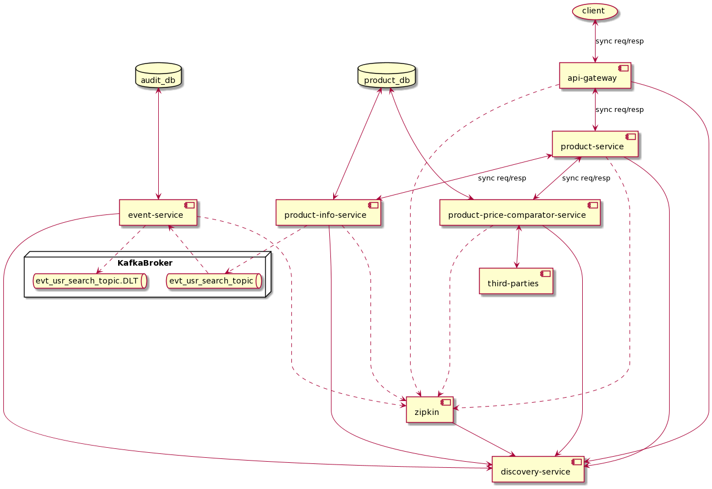
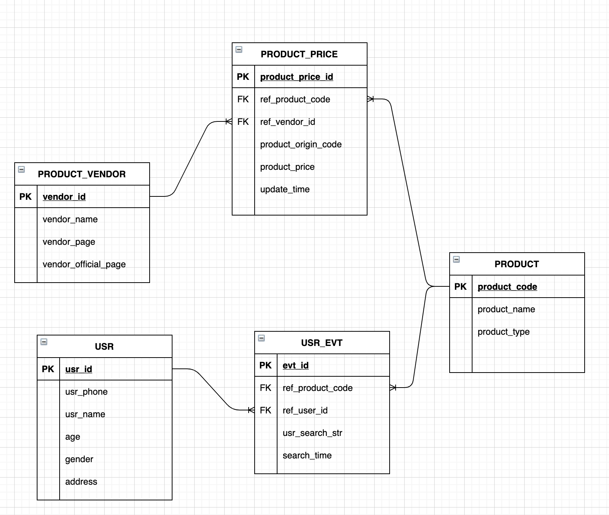

# Smart Choice System
This project applies microservice design pattern to demonstrate a price comparator system

## System Design


## Database Design


## Techs Applied

* Spring Boot, Spring Cloud.
* **H2** database
* **Netflix Zuul API Gateway** (intercepting all incoming requests,
  perform logging and distribute requests to services).
* **Feign + Ribbon** client load balancing (automatically balancing requests
  to services).
* **Eureka naming server** (Managing all services info).
* Centralized and distributed tracing server with **Spring could sleuth and Zipkin**.
  Configured to **local rabbit-mq server**.
* **Spring cloud config** (Holding configs and distribute them to services).
* **Devtool** live reload.
* Simple service managing mechanism with **Spring Actuator**.
* Distributed event streaming platform with **Kafka**
* Testing with **JUnit5**.

## Design Patterns Applied
#### Microservice pattern
#### Remote procedure invocation
A client invokes a service using a synchronous, remote procedure invocation-based protocol, such as REST (http://microservices.io/patterns/communication-style/messaging.html).
#### Messaging
A client can invoke other services using asynchronous messaging. See http://microservices.io/patterns/communication-style/messaging.html.

#### Self registration pattern
A service instance registers itself with the service registry. See http://microservices.io/patterns/self-registration.html.

#### Client-side discovery
A service client retrieves the list of available service instances from the service registry and load balances across them. See http://microservices.io/patterns/client-side-discovery.html.

#### Timeout pattern
Timeouts when waiting for a response. Using timeouts ensures that resources are never tied up indefinitely.

#### Behavioural Pattern - Strategy
Predefine a family of logics / algorithms, put each of them in separate class, and make their object interchangeable.

#### Generic method
Methods that are written with a single method declaration and can be called with arguments of different types.

#### Coding to interface
Coding to interface is a technique to write classes based on an interface; interface that defines what the behavior of the object should be. It involves creating an interface first, defining its methods and then creating the actual class with the implementation.

#### SOLID principle, OOP
Standard pattern

## Libraries and Frameworks

* Spring boot 2.3.9.RELEASE:
  * Spring-boot-starter-web
  * Spring-boot-starter-data-jpa
  * Spring-boot-starter-security
  * Spring-boot-starter-actuator

* Spring cloud Hoxton.SR10
  * Spring Cloud Gateway
  * Spring Cloud Openfeign
  * Spring Cloud Config
  * spring-cloud-starter-zipkin
  * spring-cloud-starter-sleuth
  * Spring Cloud Netflix
    * spring-cloud-starter-netflix-ribbon
    * spring-cloud-starter-netflix-eureka-client
    * spring-cloud-starter-netflix-ribbon
  * resilience4j-spring-boot2
  * spring-rabbit
  * spring-kafka

## Usage

#### Ports
| Service | Port |
| ------ | ------ |
| Product Service | 8000 |
| Product Info Service | 8100, 8101, ... |
| Product Price Comparator Service | 8200, 8201, ... |
| Event Service | 8300, 8301, ... |
| Third Party Mock Service | 8400 |
| Spring Cloud Config Server | 8888 |
| Netflix Eureka Naming Server | 8761 |
| Netflix Zuul API Gateway Server | 8765 |
| Zipkin Distributed Tracing Server | 9411 |

#### How to run
1. Start local rabbit mq
```bash
rabbitmq-server --RABBIT_URI=amqp://localhost

```
2. Start zipkin
```bash
java -jar ./src/zipkin-server-*exec.jar
```

3. Start and configure Kafka
```bash
confluent local services start #using confluent kafka
kafka-topics --create --zookeeper localhost:2181 --replication-factor 1 --partitions 3 --topic evt-usr-search-topic
kafka-topics --create --zookeeper localhost:2181 --replication-factor 1 --partitions 3 --topic evt-usr-search-topic.DLT
```

4. Start services with the following sequence
*   Netflix Eureka Naming Server -> Gateway -> CommonLib -> ProductService -> ProductInfoService -> ProductPriceComparatorService ->EventService -> ThirdPartyMockService

#### POSTMAN 
Postman collection with APIs and example responses can be found in **./docs/SmartChoice - NAB.postman_collection.json**.

#### Zipkin
Quick Start Page
* https://zipkin.io/pages/quickstart

Downloading Zipkin Jar
* https://search.maven.org/remote_content?g=io.zipkin.java&a=zipkin-server&v=LATEST&c=exec

License
----
MIT